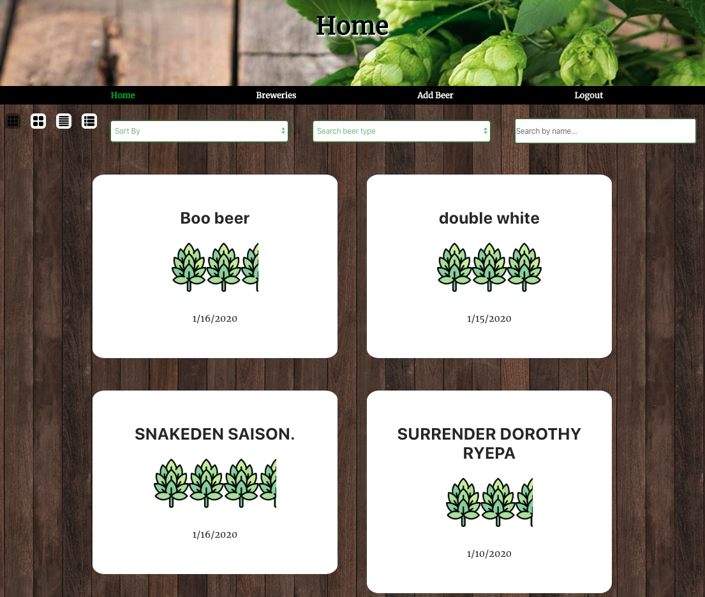

# DearBeer

#### Created by: Andrea Bender, Maria Danielson, Jonny Deates, Evan Vogts

# About
Server is used for back end of app and connects to client. 

### [Live Page](https://dearbeer.now.sh/)

## Technoligies Used
Client side: React, Javascript, Zeit, HTML and CSS.

Server side: Express.js, Node.js, PostgreSQL and Heroku. 

[Client](https://github.com/thinkful-ei-heron/Group4-Capstone-3.git) |
[Server](https://github.com/thinkful-ei-heron/Group4-Capstone3-API.git)

## URL/ Endpoints: 

## /api/auth/
POST: responds with JWT auth token using secrete when user enters valid user credentials.

PUT: Re-authenticates the user, refreshes token. 

        {
            user_name: String,
            password: String
        }

            res.body
        {
            authToken: String
        }

## /api/journals
GET: Gets and renders journals stored in database

        {
             
            journals: object
        }

POST: Submits a journal as an object and stores it in the database 

DELETE: Allows user to delete a journal by id. 

PATCH :  allows user to edit field in specific journal by id. 

## /api/users
POST: Lets user register for an account and posts data into the database so user can login next time.
        {
        user_name: String,
        password: String
        }

        {
        id: userId,
        user_name: String,
        }
 

# Landing Page

# Login Page

# Register Page

# Dashboard
Once the user has started to build their list of beers, the app will provide the user with a detailed dashboard of the generated list of beers.  The user can find beer in beer list by sorting, filtering, and searching for keywords. The dashboard also contains a feature that user can use to costumize and create different list view i.e list, tile, or expanded view.
##### Condensed View

##### Expanded View

# Add Beer Form
The add beer form is displayed with various fields for the user to input information about the beer as well as a rating and description/review of the beer. A user is also able to click a place and add a beer to their list for that location.

# Breweries Map
It also provides the user with a visual map of exactly where they have tasted all the hoppy goodness. User can search for local bars or breweries within a specified radius from their zip code .
